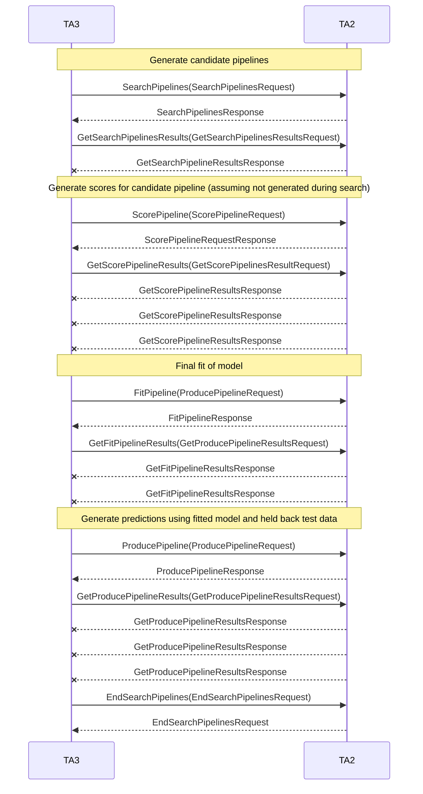

# distil-pipeline-server

Provides a stub server for testing Distil GRPC calls.

[](https://circleci.com/gh/uncharted-distil/distil-pipeline-server/tree/master)
[](https://goreportcard.com/report/github.com/uncharted-distil/distil-pipeline-server)

## Dependencies

- [Go](https://golang.org/) programming language binaries with the `GOPATH` environment variable specified and `$GOPATH/bin` in your `PATH`.

## Development

Clone the repository:

```bash
mkdir -p $GOPATH/src/github.com/uncharted-distil/
cd $GOPATH/src/github.com/uncharted-distil/
git clone git@github.com:uncharted-distil/distil-pipeline-server.git
```

Install dependencies:

```bash
cd distil-pipeline-server
make install
```

Build, watch, and run server:
```bash
make watch
```

## Syncing TA2-TA3 Submodule

The `pipeline/ta3ta2-api` submodule is set up to track the D3M program level [TA2-TA3 API Repo](https://gitlab.com/datadrivendiscovery/ta3ta2-api).
It is currently set up to track the `preprocessing_api2` branch where active development is taking place on the new version of the API. The branch
being tracked can be adjusted by changing the `branch` field in the `.gitmodules` file, if necessary.

Cloning of the contents of the submodule has been included in the `make install` command, but only for the latest commit that was commited to
this repo to ensure nothing is broken upon installation. If you would like to update the submodule to track the newest commits on the branch:

```bash
make sync_api
```

If you would like to both sync the submodule with the latest commits AND generate new GRPC/Protobuf source:

```bash
make sync_and_gen
```

## Generating GRPC/Protobuf Source

If changes are made to the `*.proto` files that requires source to be re-generated, install protocol buffer compiler:

Linux

```bash
curl -OL https://github.com/google/protobuf/releases/download/v3.3.0/protoc-3.3.0-linux-x86_64.zip
unzip protoc-3.3.0-linux-x86_64.zip -d protoc3
sudo cp protoc3/bin/protoc /usr/bin/protoc
sudo cp -r protoc3/include /usr/local
```

OSX

```bash
curl -OL https://github.com/google/protobuf/releases/download/v3.3.0/protoc-3.3.0-osx-x86_64.zip
unzip protoc-3.3.0-osx-x86_64.zip -d protoc3
sudo cp protoc3/bin/protoc /usr/bin/protoc
sudo cp -r protoc3/include /usr/local
```

Generate GRPC source from proto definition:
```base
make proto
```

## Docker Deployment

Create a docker image from current source:
```bash
cd deploy
./docker_build.sh
```

Run the container:
```bash
./docker_run.sh
```

## Releasing

1.  Tag source using semantic versioning.
2.  Update the tag version in `deploy/config.sh'.
3.  Build and push.

## Common Issues:

#### "dep: command not found":

- **Cause**: `$GOPATH/bin` has not been added to your `$PATH`.
- **Solution**: Add `export PATH=$PATH:$GOPATH/bin` to your `.bash_profile` or `.bashrc`.

#### "../repo/subpackage/file.go:10:2: cannot find package "github.com/company/package/subpackage" in any of":

- **Cause**: Dependencies are out of date or have not been installed
- **Solution**: Run `make install` to install latest dependencies.

## Message Flows for V2 TA3TA2 API

This flow is equivalent to the the basic CreatePipelines request and result stream used in version one of the API.  For the purposes of illustration, we only deal with a single pipeline being generated.  It is now up to the TA3 system to manage data supplied to the scoring and prediction (produce) steps.



